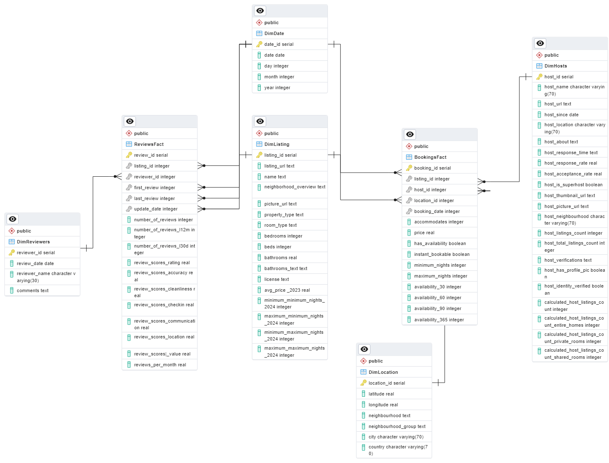

# Airbnb_DataWarehouse
## Project Overview:
This project involves the creation of a data warehouse tailored specifically for Airbnb data related to properties in Barcelona. The data warehouse serves as a centralized repository for storing, organizing, and analyzing various aspects of Airbnb listings, bookings, reviews, and host information.

